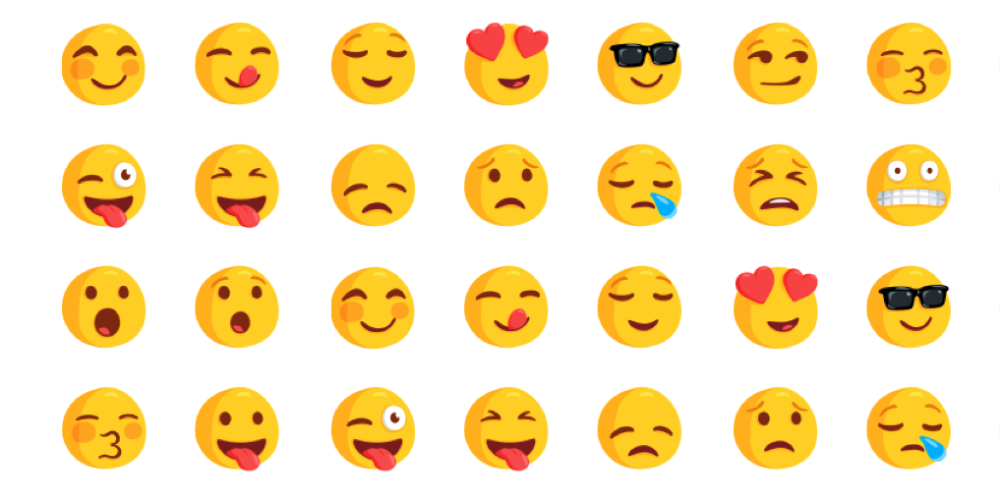

```{r setup, include=FALSE}
knitr::opts_chunk$set(echo = TRUE)
```
*Reminder: some codes are hidden from the html report.  
To see the full code, please see the "FinalReport.Rmd".  
If you wanna run whole code, remember to turn all chunks' eval option into TRUE*  
  
  
*By the way, some analysis are already included in the Startercode "HappyDB_RShiny.Rmd" which is also included in the /doc folder.  
This report won't include those existing results.*  



This project aims to analysis what makes people happy, from the data collected in [HappyDB](https://rit-public.github.io/HappyDB/)  
HappyDB is a corpus of 100,000 crowd-sourced happy moments via Amazon's Mechanical Turk.
The survey question is:
```
What made you happy today?  Reflect on the past {24 hours|3 months}, and recall three actual events that happened to you that made you happy.  Write down your happy moment in a complete sentence.
Write three such moments.
Examples of happy moments we are NOT looking for (e.g events in distant past, partial sentence):
    - The day I married my spouse
    - My Dog
```
You can read more about it on https://arxiv.org/abs/1801.07746


```{r load libraries, warning=FALSE, message=FALSE, echo=FALSE, cache=TRUE}
packages.used=c("tm", "tidytext", "tidyverse", 
                "DT", "mallet", "syuzhet",
                "scales","wordcloud2","gridExtra",
                "ngram","plotly")

# check packages that need to be installed.
packages.needed=setdiff(packages.used, 
                        intersect(installed.packages()[,1], 
                                  packages.used))
# install additional packages
if(length(packages.needed)>0){
  install.packages(packages.needed, dependencies = TRUE)
}

library(tm)
library(tidytext)
library(tidyverse)
library(DT)
library(mallet)
library(syuzhet)

library(scales)
library(wordcloud2)
library(gridExtra)
library(ngram)

library(plotly)
```

### Step 0 - Load the data and pre-process them

The *text_processing.Rmd*(provided by ) clean the text by converting all the letters to the lower case, and removing punctuation, numbers, empty words, extra white space, and stemming words, removing stop words, and choosing the words with highest frequency for each moments.  

*However, the original text_processing.Rmd* has some weakness, which didn't transform different verb tense to its simple tense very well.
```{r read data, warning=FALSE, message=FALSE, cache=TRUE}
# Load Data (Download if not exists)
if(!file.exists("../data/cleaned_hm.csv")){
  urlfile<-'https://raw.githubusercontent.com/rit-public/HappyDB/master/happydb/data/cleaned_hm.csv'
  hm_data <- read_csv(urlfile)
}
# Process data if the processed_moments not exists
if(!file.exists("../output/processed_moments.csv")){
  hm_data = read_csv("../data/cleaned_hm.csv")
  source(purl("../lib/Text_Processing.Rmd",output=tempfile()))
}
if(!file.exists("../data/demographic.csv")){
  urlfile<-'https://raw.githubusercontent.com/rit-public/HappyDB/master/happydb/data/demographic.csv'
  demo_data <- read_csv(urlfile)
}
demo_data=read_csv("../data/demographic.csv")
hm_data=read_csv("../output/processed_moments.csv")
```

We also combine the happy moments data with the worker's demographic data.  
To make our research more specific, we filter out some special data like other gender, NA gender.   
[Code hidden]
```{r combining data, warning=FALSE, message=FALSE,echo=FALSE, cache=TRUE}
# Combine both the data sets and keep the required columns for analysis
# We select a subset of the data that satisfies specific row conditions.
hm_data <- hm_data %>%
  inner_join(demo_data, by = "wid") %>%
  select(wid,
         original_hm,
         gender, 
         marital, 
         parenthood, 
         reflection_period, 
         age, 
         country, 
         ground_truth_category, 
         text) %>%
  mutate(count = sapply(hm_data$text, wordcount)) %>%
  mutate(age=as.numeric(age)) %>%
  mutate(originalcount = sapply(hm_data$original_hm, wordcount)) %>%
  filter(gender %in% c("m", "f")) %>%
  filter(marital %in% c("single", "married")) %>%
  filter(parenthood %in% c("n", "y")) %>%
  filter(reflection_period %in% c("24h", "3m")) %>%
  mutate(reflection_period = fct_recode(reflection_period, 
                                        months_3 = "3m", hours_24 = "24h"))

hm_data=hm_data[hm_data$age<200& !is.na(hm_data$age),]
# unique(hm_data$age)
# head(sort(hm_data$age,decreasing = T),100)
```

# Basic Exploration of Data

## Description
First, let's have a quick look at several data examples:
```{r example data, warning=FALSE, message=FALSE,echo=FALSE, cache=TRUE}
head(hm_data)
```
We can see, that demographic data include their gender, marital, parentihood, age, country, etc. And the original happy moments data consists of 1 sentence in each moment.  
For detail Description, see [HappyDB](https://rit-public.github.io/HappyDB/)  

## Sentence Length
We can perform a statistical analysis based on the number of words. 
```{r wordcount, cache=TRUE}
summary(hm_data$originalcount)
```
So strange, how can the moments sentence be so long as 1155? Let's see those long sentence with length > 1000
```{r, warning=FALSE, message=FALSE,echo=FALSE, cache=TRUE}
substr(hm_data$original_hm[hm_data$originalcount>1000],0,200)
```
Oh, I see, these people just ignore the requirement of the tasks! **They wrote essays about their happy moments!!**
OK, just exclude them from the data. 
No way to let them increase their weight by 100 times huh.
*All plot in this report can cursor over it and see the detail number*
```{r, cache=TRUE}
hm_data=hm_data[hm_data$originalcount<500,]
summary(hm_data$originalcount)
hist(hm_data$originalcount[hm_data$originalcount<100],main="Happy Moments' Sentence Length",xlab = "Length")
```

Most of the happy moments are short sentences (<20 words), as expected!  
Some happy moments even have only two words.  

# Further Analysis
## Happiness Doesn't Depend on Demographic Difference
We tried to find out whether **Demographic Difference** influence Happiness. 

Intuitively, we believe that Demographic may influence the emotion. For example, young people may be happier than old man as they have more time to play, Japanese man may suffer from high pressure...    
The first naive solution is, find the frequency difference between happy moments of different demographic attributes.
```{r, warning=FALSE, message=FALSE,echo=FALSE, cache=TRUE}
plot_ly(
  x = c("Male", "Female", "Single", "Married Parent", "Married NonParent"),
  y = c(sum(hm_data$gender=="m"), sum(hm_data$gender=="f"), 
        sum(hm_data$marital=="single"), 
        sum(hm_data$marital=="married" & hm_data$parenthood=="y"),
        sum(hm_data$marital=="married" & hm_data$parenthood=="n")
        ),
  name = "moments number for different demographic groups",
  type = "bar"
)
table <- data.frame(x = c("Twenties", "Thirties", "Forties", "Fifties", "Sixties", "Seventy+"),
                    y = c(
        sum(hm_data$age>=20 & hm_data$age<30),
        sum(hm_data$age>=30 & hm_data$age<40),
        sum(hm_data$age>=40 & hm_data$age<50),
        sum(hm_data$age>=50 & hm_data$age<60),
        sum(hm_data$age>=60 & hm_data$age<70),
        sum(hm_data$age>=70) )
)
table$x <- factor(table$x, levels = c("Twenties", "Thirties", "Forties", "Fifties", "Sixties", "Seventy+"))
plot_ly(
  data=table,
  x = ~x,
  y = ~y,
  name = "moments number for different age groups",
  type = "bar"
)
```
Well, seems there really are some difference.   
However, it must be due to the sample bias, which means, the difference could be due to the sample size difference of the demographic group, such as, there are more females taking survey than males.  
So how to accurately compare each group, in order to answer this question?  
Based on a general Sentimental Corpus, using [Syuzhet Package](https://cran.r-project.org/web/packages/syuzhet/vignettes/syuzhet-vignette.html), we can have a sentimental analysis for each group's moments' sentences.  
[Code hidden]
```{r sentiment, warning=FALSE, message=FALSE,echo=FALSE, cache=TRUE}
sentiment.values <- get_sentiment(hm_data$text[(hm_data$age>=20 & hm_data$age<30)], method="syuzhet")
p <- plot_ly(type = 'box') %>%
    add_boxplot(y = sentiment.values, boxpoints = 'outliers',
              name = "Twenties")

sentiment.values <- get_sentiment(hm_data$text[hm_data$age>=30 & hm_data$age<40], method="syuzhet")
p = p %>%
  add_boxplot(y = sentiment.values, boxpoints = 'outliers',
              name = "Thirties")

sentiment.values <- get_sentiment(hm_data$text[hm_data$marital=="single"], method="syuzhet")
p = p %>%
  add_boxplot(y = sentiment.values, boxpoints = 'outliers',
              name = "Forties")

sentiment.values <- get_sentiment(
  hm_data$text[hm_data$marital=="married" & hm_data$parenthood=="y"],
  method="syuzhet")
p = p %>%
  add_boxplot(y = sentiment.values, boxpoints = 'outliers',
              name = "Fifties")

sentiment.values <- get_sentiment(
  hm_data$text[hm_data$marital=="married" & hm_data$parenthood=="n"],
  method="syuzhet")
p = p %>%
  add_boxplot(y = sentiment.values, boxpoints = 'outliers',
              name = "Sixties")
p
```
```{r sentiment2, warning=FALSE, message=FALSE,echo=FALSE, cache=TRUE}
y1=sentiment.values <- get_sentiment(hm_data$text[(hm_data$age>=20 & hm_data$age<30)], method="syuzhet")
y2=sentiment.values <- get_sentiment(hm_data$text[(hm_data$age>=30 & hm_data$age<40)], method="syuzhet")
y3=sentiment.values <- get_sentiment(hm_data$text[(hm_data$age>=40 & hm_data$age<50)], method="syuzhet")
y4=sentiment.values <- get_sentiment(hm_data$text[(hm_data$age>=50 & hm_data$age<60)], method="syuzhet")
y5=sentiment.values <- get_sentiment(hm_data$text[(hm_data$age>=60 & hm_data$age<70)], method="syuzhet")
y6=sentiment.values <- get_sentiment(hm_data$text[(hm_data$age>=70)], method="syuzhet")
x=table$x
x=c(
rep(x[1],length(y1)),
rep(x[2],length(y2)),
rep(x[3],length(y3)),
rep(x[4],length(y4)),
rep(x[5],length(y5)),
rep(x[6],length(y6)) )
y=c(y1,y2,y3,y4,y5,y6)
x=as.factor(x)
levels(x)=c("Twenties", "Thirties", "Forties", "Fifties", "Sixties", "Seventy+")
table=data.frame(x=x,y=y)
p <- plot_ly(table, y = ~y, color = ~x, type = "box")
p
```
Surprisingly, there is little difference on sentiment index across on gender, family and age.  

## Does Season Affect Happiness
we don't have timestamp of the moments collected. So, we can only find whether the moments contain certain season words, such as "Spring", "Autumn", "Winter" and "Summer". 
```{r}
sum(unlist(strsplit(hm_data$text,split = " "))=="spring")
sum(unlist(strsplit(hm_data$text,split = " "))=="summer")
sum(unlist(strsplit(hm_data$text,split = " "))=="winter")
sum(unlist(strsplit(hm_data$text,split = " "))=="autumn")
```
We tried to find "Autumn", but there is zero "Autumn" mentioned in the moments, so we use "Fall" instead.  
```{r}
sum(unlist(strsplit(hm_data$text,split = " "))=="fall")
```
However, fall may be the verb "fall" instead of season "Fall"  

In conclusion, we find summer has the most occurrence in happy moments. Thus, summer may be the best source among seasons.

## Word Count
```{r wordcloud, warning=FALSE, message=FALSE,echo=FALSE, cache=TRUE}
bag_of_words <-  hm_data %>%
  unnest_tokens(word, text)

word_count <- bag_of_words %>%
  count(word, sort = TRUE)

word_count %>%
      slice(1:100) %>%
      wordcloud2(size = 0.6,
                 rotateRatio = 0)
```

We create a word cloud for all happy moments, we can see that "friend", "spending" "day" terms has a very high occurrences. 


## compute TF-IDF weighted document-term matrices.

The above wordcloud is too simple.
As we would like to identify interesting words for each group, we use [TF-IDF](https://en.wikipedia.org/wiki/Tf%E2%80%93idf) to weigh each term within each group.  
For example, consider which terms is relatively more frequent in 3-month moments:
```{r wordcloud2, warning=FALSE, message=FALSE,echo=FALSE, cache=TRUE}

month3 <-  hm_data[hm_data$reflection_period=="months_3",] %>%
  unnest_tokens(word, text) %>%
  count(word, sort = TRUE)

word_count <- month3 %>%
  inner_join(word_count, by = "word")

word_count$n.y=word_count$n.y+1

wc=data.frame(word=word_count$word,n=word_count$n.x/word_count$n.y)
wc$n=as.integer(wc$n*1000)
wc=wc[order(-wc$n),]
wc %>%
      slice(1:100) %>%
      wordcloud2(size = 0.6,
                 rotateRatio = 0)
```
We can see, that moments like valentines will be more impressive and last longer in memory.
